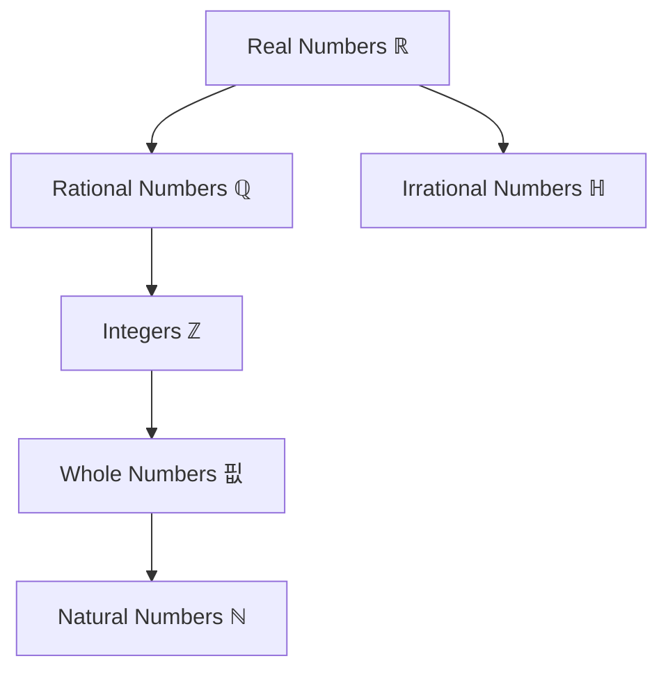

# Chapter R: Review of Prerequisites - Method Extractions
**Source**: College Algebra & Trigonometry 2nd Edition - Miller/Gerken  
**Pages**: 1-84 (Chapter R complete)
**Target**: Foundation for all subsequent chapters  
**Tags**: #textbook #extraction #prerequisites #foundation

---

## 📚 EXTRACTION METHODOLOGY

Following the Universal Knowledge Framework approach, this document extracts:
1. **Explicit Knowledge**: Stated definitions, formulas, procedures
2. **Implicit Knowledge**: Assumed prerequisites, unstated steps
3. **Common Errors**: What NOT to do
4. **Relational Connections**: How concepts relate across mathematics

---

## 📐 SECTION R.1: SETS AND THE REAL NUMBER LINE

> See [[Real_Number_System]] for comprehensive coverage of number classifications.

### Core Concept: Real Number System Hierarchy

**The Foundation Structure**:


#### Key Definitions (Atomic Knowledge Units)

**1. Natural Numbers (ℕ)**: {1, 2, 3, ...}
- **Relational Note**: Starting point for counting
- **Use Case**: Discrete counting, sequence indexing

**2. Whole Numbers (핎)**: {0, 1, 2, 3, ...}
- **Relational Note**: Natural numbers + zero
- **Critical Distinction**: Zero is NOT natural but IS whole

**3. Integers (ℤ)**: {..., −3, −2, −1, 0, 1, 2, 3, ...}
- **Relational Note**: Whole numbers + their opposites
- **Property**: Closed under addition, subtraction, multiplication

**4. Rational Numbers (ℚ)**: {p/q | p, q ∈ ℤ and q ≠ 0}
- **Key Recognition**: Can be expressed as ratio of integers
- **Includes**: All terminating decimals, all repeating decimals
- **Examples**: 
  - Terminating: 0.71 = 71/100
  - Repeating: 0.6̄ = 2/3

**5. Irrational Numbers (ℍ)**: Cannot be expressed as ratio
- **Key Recognition**: Nonterminating, nonrepeating decimals
- **Examples**: π, √2, e
- **CRITICAL**: ℚ ∪ ℍ = ℝ (union gives all reals)

---

### Method 1: Interval Notation Translation

> See [[Interval_Notation]] for detailed coverage.

**Purpose**: Convert between set-builder and interval notation

**Key Patterns**:
| Set-Builder | Interval | Meaning | Graph Symbol |
|------------|----------|---------|--------------|
| {x \| x > a} | (a, ∞) | Strictly greater | Open circle ( |
| {x \| x ≥ a} | [a, ∞) | Greater or equal | Closed circle [ |
| {x \| x < b} | (−∞, b) | Strictly less | Open circle ) |
| {x \| x ≤ b} | (−∞, b] | Less or equal | Closed bracket ] |
| {x \| a < x < b} | (a, b) | Between (open) | ( ) |
| {x \| a ≤ x ≤ b} | [a, b] | Between (closed) | [ ] |

#### 🧠 Implicit Knowledge Required
- Parentheses ( ) mean "NOT included"
- Brackets [ ] mean "IS included"  
- Infinity symbols (∞, −∞) ALWAYS use parentheses (never brackets)
- The symbol ∞ represents unbounded behavior, NOT a number

#### ⚠️ Common Errors
- Using [∞) or (−∞] — infinity cannot be included
- Confusing (a, b) interval with (a, b) ordered pair
- Forgetting that [a, a] = {a} (single point)

---

### Method 2: Set Operations (Union and Intersection)

**Union (∪)**: Elements in A OR B or both
```
A ∪ B = all elements from either set
```

**Intersection (∩)**: Elements in BOTH A AND B
```
A ∩ B = only common elements
```

#### Critical Example Pattern
```
D = {x | x < 4}     E = {x | x ≥ −2}

D ∩ E = {x | −2 ≤ x < 4}  ← overlap region
D ∪ E = ℝ                  ← covers entire real line
```

#### 🧠 Implicit Knowledge Required
- **Intersection = AND logic** (must satisfy both conditions)
- **Union = OR logic** (satisfy at least one condition)
- Empty intersection: A ∩ B = { } when no overlap
- Visual: Draw number lines to see overlap

#### ⚠️ Common Errors
- Confusing ∪ and ∩ symbols
- Writing union when you mean intersection
- Not recognizing when intersection is empty

---

### Method 3: Absolute Value Interpretation

> See [[Absolute_Value]] for complete theory and applications.

**Definition**: Distance from zero on number line
```
|x| = {  x    if x ≥ 0
       {−x    if x < 0
```

**Key Insight**: |x| is ALWAYS non-negative

#### Critical Pattern: Removing Absolute Value Bars
```
To simplify |expression|:
1. Determine if expression ≥ 0 or < 0
2. If ≥ 0: remove bars, keep expression
3. If < 0: remove bars, negate expression
```

**Example**: |√3 − 3|
- Since √3 ≈ 1.73 < 3, we have √3 − 3 < 0
- Therefore: |√3 − 3| = −(√3 − 3) = 3 − √3

#### Distance Property
**Distance between a and b**: |a − b| = |b − a|

#### 🧠 Implicit Knowledge Required
- Absolute value bars act as grouping symbols (simplify inside first)
- |−x| = |x| for all real x
- |xy| = |x||y| (multiplicative property)

#### ⚠️ Common Errors
- Thinking |−5| = −5 (correct: |−5| = 5)
- Confusing −|x| with |−x|
  - |−4| = 4
  - −|4| = −4
  - −|−4| = −4

---

### Method 4: Order of Operations (PEMDAS)

> See [[Order_of_Operations]] for comprehensive examples.

**Critical Sequence**:
1. **P**arentheses (and other grouping: |  |, √‾, fraction bars)
2. **E**xponents and roots
3. **MD**: Multiplication and Division (left to right)
4. **AS**: Addition and Subtraction (left to right)

#### Key Principle: Work from INSIDE OUT with nested grouping

**Example Breakdown**:
```
7 − {8 + 4[2 − (5 − √64)²]}

Step 1: Innermost parentheses, evaluate √64 = 8
     = 7 − {8 + 4[2 − (5 − 8)²]}
     
Step 2: Subtract inside parentheses: 5 − 8 = −3
     = 7 − {8 + 4[2 − (−3)²]}
     
Step 3: Evaluate exponent: (−3)² = 9
     = 7 − {8 + 4[2 − 9]}
     
Step 4: Subtract in brackets: 2 − 9 = −7
     = 7 − {8 + 4(−7)}
     
Step 5: Multiply: 4(−7) = −28
     = 7 − {8 − 28}
     
Step 6: Subtract in braces: 8 − 28 = −20
     = 7 − (−20)
     
Step 7: Final subtraction: 7 + 20 = 27
```

#### 🧠 Implicit Knowledge Required
- Nested grouping: work innermost to outermost
- Fraction bar acts as grouping symbol (evaluate top and bottom separately)
- Radical sign acts as grouping symbol
- Negative exponents: b⁻ⁿ = 1/bⁿ
- Zero exponent: b⁰ = 1 (for b ≠ 0)

#### ⚠️ Common Errors
- Evaluating left to right without respecting order
- Forgetting that division is NOT associative: (a ÷ b) ÷ c ≠ a ÷ (b ÷ c)
- Confusing −3² with (−3)²
  - −3² = −9 (exponent applies to 3 only)
  - (−3)² = 9 (exponent applies to −3)

---

### Method 5: Properties of Real Numbers (Algebraic Structure)

> See [[Algebraic_Manipulation]] for application examples.

**Commutative Properties**:
```
a + b = b + a          (Addition)
a · b = b · a          (Multiplication)
```
**Key**: Order doesn't matter

**Associative Properties**:
```
(a + b) + c = a + (b + c)     (Addition)
(a · b) · c = a · (b · c)     (Multiplication)
```
**Key**: Grouping doesn't matter

**Distributive Property**:
```
a(b + c) = ab + ac
```
**Key**: Factor outside multiplies each term inside

**Identity Elements**:
```
a + 0 = a              (Additive identity)
a · 1 = a              (Multiplicative identity)
```

**Inverse Elements**:
```
a + (−a) = 0           (Additive inverse)
a · (1/a) = 1          (Multiplicative inverse, a ≠ 0)
```

#### Application: Simplifying Algebraic Expressions

**Example**: 5 − 2(4c − 8d) + 3(1 − d) + c

**Step-by-Step**:
```
1. Distribute: 5 − 8c + 16d + 3 − 3d + c
2. Group like terms: (5 + 3) + (−8c + c) + (16d − 3d)
3. Simplify: 8 − 7c + 13d
```

#### 🧠 Implicit Knowledge Required
- **Like terms**: Same variable(s) with same exponent(s)
- Combining like terms uses distributive property in reverse
- Constants are like terms with each other
- Negative sign before parentheses: −(a − b) = −a + b

#### ⚠️ Common Errors
- Not distributing negative sign: −(a − b) ≠ −a − b
- Adding unlike terms: 2x + 3y ≠ 5xy
- Forgetting coefficient of 1: x = 1x

---

### Critical Division Rules

**Division by Zero**:
1. **5/0 = undefined** (division by zero is undefined)
2. **0/5 = 0** (zero divided by nonzero is zero)
3. **0/0 = indeterminate** (studied in calculus)

---

## 📐 SECTION R.2: INTEGER EXPONENTS AND SCIENTIFIC NOTATION

### Core Concept: Exponential Notation

**Definition**: For natural number n and real b:
```
bⁿ = b · b · b · ... · b  (n factors of b)
     └──────────────────┘
          n times
```

**Key Terms**:
- **Base**: The number being multiplied (b)
- **Exponent/Power**: Number of factors (n)
- **Read as**: "b to the nth power"

---

### Method 1: Zero and Negative Exponents

**Zero Exponent**:
```
b⁰ = 1    (for b ≠ 0)
```

**Why?**: From division property: b³/b³ = b³⁻³ = b⁰ = 1

**Negative Exponent**:
```
b⁻ⁿ = 1/bⁿ = (1/b)ⁿ    (for b ≠ 0)
```

**Key Insight**: Negative exponent means "take reciprocal"

#### Critical Examples

**1. Distinguishing Similar Expressions**:
```
6x⁰ = 6 · x⁰ = 6 · 1 = 6              (exponent applies to x only)
(6x)⁰ = 1                              (exponent applies to entire 6x)
−5⁰ = −1 · 5⁰ = −1 · 1 = −1           (exponent applies to 5 only)
```

**2. Negative Exponents**:
```
5⁻² = 1/5² = 1/25                      (move to denominator, make positive)
1/p⁻⁴ = 1/(1/p⁴) = p⁴                 (reciprocal of reciprocal)
5x⁻⁸y² = 5 · (1/x⁸) · y² = 5y²/x⁸     (only x has negative exponent)
```

#### 🧠 Implicit Knowledge Required
- Parentheses determine what the exponent applies to
- Negative in front vs. negative exponent:
  - −x⁻² = −(1/x²) = −1/x²
  - (−x)⁻² = 1/(−x)² = 1/x²

#### ⚠️ Common Errors
- Thinking b⁰ = 0 (NO! b⁰ = 1 for b ≠ 0)
- Thinking b⁻ⁿ is negative (NO! Just means reciprocal)
- Confusing −xⁿ with (−x)ⁿ

---

### Method 2: Properties of Exponents

> See [[Exponent_Properties]] for comprehensive coverage of all exponent rules.

**Product Rule**: Same base → add exponents
```
bᵐ · bⁿ = bᵐ⁺ⁿ
Example: x⁴ · x³ = x⁴⁺³ = x⁷
```

**Quotient Rule**: Same base → subtract exponents
```
bᵐ/bⁿ = bᵐ⁻ⁿ
Example: t⁶/t² = t⁶⁻² = t⁴
```

**Power Rule**: Power to a power → multiply exponents
```
(bᵐ)ⁿ = bᵐⁿ
Example: (x²)³ = x²·³ = x⁶
```

**Power of Product**: Distribute exponent
```
(ab)ᵐ = aᵐbᵐ
Example: (4x)³ = 4³x³ = 64x³
```

**Power of Quotient**: Distribute exponent
```
(a/b)ᵐ = aᵐ/bᵐ
Example: (2/y)² = 2²/y² = 4/y²
```

#### Complex Example Breakdown

**Simplify**: (14a²b⁷/2a⁵b)⁻²

```
Step 1: Simplify inside parentheses first
     = (7a²⁻⁵b⁷⁻¹)⁻²
     = (7a⁻³b⁶)⁻²

Step 2: Distribute the −2 exponent
     = 7⁻²(a⁻³)⁻²(b⁶)⁻²
     = 7⁻² · a⁶ · b⁻¹²

Step 3: Eliminate negative exponents
     = (1/49) · a⁶ · (1/b¹²)
     = a⁶/(49b¹²)
```

#### 🧠 Implicit Knowledge Required
- Work inside out (parentheses first, then exponents)
- Only bases that match can use product/quotient rules
- When simplifying, final answer should have positive exponents only
- (−b)ⁿ: even n gives positive, odd n keeps negative

#### ⚠️ Common Errors
- Adding exponents when multiplying different bases: x² · y³ ≠ (xy)⁵
- Multiplying exponents when adding: x² + x³ ≠ x⁵
- Distributing exponent incorrectly: (x + y)² ≠ x² + y²

---

### Method 3: Scientific Notation

**Definition**: a × 10ⁿ where 1 ≤ |a| < 10 and n is an integer

**Purpose**: Express very large or very small numbers compactly

**Key Patterns**:
```
Large numbers (≥ 10):    positive exponent on 10
Small numbers (0 to 1):  negative exponent on 10
Numbers 1-10:            exponent is 0
```

#### Conversion Method

**To Scientific Notation**:
1. Move decimal to create 1 ≤ |a| < 10
2. Count moves: n = number of positions moved
3. If original > 10: n is positive
4. If original < 1: n is negative

**Examples**:
```
45,000,000 = 4.5 × 10⁷     (moved 7 left → positive 7)
0.0000002 = 2.0 × 10⁻⁷     (moved 7 right → negative 7)
1.2 = 1.2 × 10⁰            (no move → zero exponent)
```

**From Scientific Notation**:
1. Positive exponent: move decimal right
2. Negative exponent: move decimal left
3. Insert zeros as needed

**Examples**:
```
1.36 × 10⁷ = 13,600,000    (move 7 right)
3.9 × 10⁻³ = 0.0039        (move 3 left)
```

#### Operations in Scientific Notation

**Multiplication**:
```
(6.7 × 10⁸)(8.76 × 10³) = (6.7)(8.76) × 10⁸⁺³
                         = 58.692 × 10¹¹
                         = 5.8692 × 10¹² ← adjust to proper form
```

**Division**:
```
(4.056 × 10⁷)/(1.56 × 10⁵) = (4.056/1.56) × 10⁷⁻⁵
                             = 2.6 × 10²
```

#### 🧠 Implicit Knowledge Required
- Final answer must have 1 ≤ |a| < 10 (adjust exponent if needed)
- Calculator displays E for ×10ⁿ: 5.87E12 = 5.87 × 10¹²
- Negative exponents mean small numbers, NOT negative numbers

#### ⚠️ Common Errors
- Wrong direction: 5.2 × 10³ = 0.0052 (NO! Should be 5200)
- Not adjusting final form: 58.2 × 10⁴ must become 5.82 × 10⁵
- Thinking 10⁻ⁿ makes number negative

---

## 📐 SECTION R.3: RATIONAL EXPONENTS AND RADICALS

### Core Concept: nth-Roots

**Definition**: For integer n > 1 and real number a,
```
ⁿ√a = b   means   bⁿ = a
```

**Terms**:
- **Radical sign**: ⁿ√ 
- **Radicand**: a (the value under the radical)
- **Index**: n (the type of root)

**Special Cases**:
```
Square root: √a means ²√a  (index 2 implied)
Cube root: ³√a
Fourth root: ⁴√a
```

#### Critical Recognition Patterns

**Even Index** (n = 2, 4, 6, ...):
- Radicand must be ≥ 0
- Result is always ≥ 0 (principal root)
- ⁴√(-1) is NOT a real number

**Odd Index** (n = 3, 5, 7, ...):
- Radicand can be any real number
- Result has same sign as radicand
- ³√(-8) = -2 (real number)

**Key Examples**:
```
⁵√32 = 2          because 2⁵ = 32
√(49/64) = 7/8    because (7/8)² = 49/64
³√(-0.008) = -0.2 because (-0.2)³ = -0.008
⁴√(-1) = undefined (not real)
−⁴√1 = -1 · ⁴√1 = -1 · 1 = -1
```

---

### Method 1: Rational Exponents

**Fundamental Definitions**:
```
a^(1/n) = ⁿ√a                   (nth root)
a^(m/n) = ⁿ√(aᵐ) = (ⁿ√a)ᵐ      (power and root)
```

**Key Insight**: Denominator of exponent = index of radical

#### Conversion Examples

**Exponent → Radical**:
```
25^(1/2) = √25 = 5
(64/27)^(1/3) = ³√(64/27) = 4/3
32^(3/5) = ⁵√(32³) = (⁵√32)³ = 2³ = 8
```

**Radical → Exponent**:
```
⁵√a³ = a^(3/5)
6√x = 6x^(1/2)
³√(x³ + y³) = (x³ + y³)^(1/3)
```

#### Order of Operations Choice

For a^(m/n), TWO valid approaches:
```
Method 1: Root first, then power
32^(3/5) = (⁵√32)³ = (2)³ = 8

Method 2: Power first, then root
32^(3/5) = ⁵√(32³) = ⁵√4096 = 8
```

**Strategy**: Use smaller numbers!
- Root first usually gives smaller intermediate values
- Power first can create very large numbers

#### 🧠 Implicit Knowledge Required
- a^(1/n) only defined when ⁿ√a is real
- For even n, require a ≥ 0
- Negative exponent: a^(-m/n) = 1/a^(m/n)
- Zero exponent: a⁰ = 1 (still applies)

#### ⚠️ Common Errors
- Thinking (-81)^(1/4) is real (NO! Even root of negative)
- Confusing a^(1/2) with 1/a² (a^(1/2) = √a)
- Wrong order: (a^m)^(1/n) ≠ a^m · a^(1/n)

---

### Method 2: Simplifying Radicals

**Four Criteria for Simplified Radical**:

1. **No perfect nth-powers in radicand** (except 1)
   - Example: √12 = √(4·3) = 2√3 ✓
   - Not: √12 (contains perfect square 4) ✗

2. **No fractions in radicand**
   - Example: √(x/4) = √x/2 ✓
   - Not: √(x/4) ✗

3. **No radicals in denominator**
   - Example: 1/√2 = √2/2 ✓
   - Not: 1/√2 ✗

4. **No common factor between exponents and index**
   - Example: ⁴√x² = (x²)^(1/4) = x^(1/2) = √x ✓
   - Not: ⁴√x² ✗

---

### Method 3: Properties of Radicals

> See [[Radical_Properties]] for detailed property explanations and examples.

**Product Property**:
```
ⁿ√a · ⁿ√b = ⁿ√(ab)    (same index required)
```

**Quotient Property**:
```
ⁿ√a / ⁿ√b = ⁿ√(a/b)    (same index required)
```

**Power Property**:
```
(ⁿ√a)ᵐ = ⁿ√(aᵐ)
```

**Nested Radical Property**:
```
ᵐ√(ⁿ√a) = ᵐⁿ√a
Example: ⁴√(³√x) = ¹²√x
```

**Absolute Value Property**:
```
If n is even: ⁿ√(aⁿ) = |a|
If n is odd:  ⁿ√(aⁿ) = a

Examples:
√(x²) = |x|          (even index needs absolute value)
³√(x³) = x           (odd index doesn't need it)
⁴√(x⁸) = |x²| = x²   (result already positive)
```

#### Application: Simplifying Complex Radicals

**Example**: ⁴√(32x⁹y⁶)

```
Step 1: Factor radicand completely
     = ⁴√(2⁵ · x⁹ · y⁶)

Step 2: Identify perfect 4th powers
     = ⁴√[(2⁴ · x⁸ · y⁴) · (2 · x · y²)]

Step 3: Apply product property
     = ⁴√(2⁴x⁸y⁴) · ⁴√(2xy²)

Step 4: Simplify perfect 4th powers
     = 2x²y · ⁴√(2xy²)
```

#### 🧠 Implicit Knowledge Required
- Factor radicand to identify perfect powers
- Index n means look for factors with exponent n
- Pull out factors whose exponent ≥ index
- Remaining factors stay inside radical

#### ⚠️ Common Errors
- Adding radicals with different indices: √2 + ³√2 (can't combine)
- Applying product property with different indices: √a · ³√b ≠ ⁶√(ab)
- Forgetting absolute value: √(x²) ≠ x (correct: √(x²) = |x|)

---

### Method 4: Rationalizing Denominators

**Goal**: Remove radicals from denominators

**Type 1: Single Radical Term**
```
Strategy: Multiply by form of 1 that creates perfect power

Example: 1/√2
Solution: (1/√2) · (√2/√2) = √2/2
```

**Type 2: Radical with Coefficient**
```
Example: √(x³/9)
Solution: √x³/3 = (x√x)/3  (still has radical in numerator - OK!)
```

**Type 3: Quotient of Radicals**
```
Example: ³√(3x⁷y) / ³√(81xy⁴)

Step 1: Combine into single radical
     = ³√(3x⁷y / 81xy⁴)

Step 2: Simplify fraction inside
     = ³√(x⁶ / 27y³)

Step 3: Evaluate
     = x² / 3y
```

#### 🧠 Implicit Knowledge Required
- Rationalize by creating perfect power in denominator
- Multiply by radical/itself (equivalent to 1)
- ⁿ√aⁿ = a allows us to remove radical
- Final answer may still have radicals in numerator

#### ⚠️ Common Errors
- Thinking radicals can't be in numerator (they can!)
- Not simplifying radical before rationalizing
- Forgetting to simplify fraction inside radical first

---

### Method 5: Operations with Radicals

**Addition/Subtraction**: Only LIKE radicals
```
Like radicals: same index AND same radicand

Can combine: 5³√(7t²) - 2³√(7t²) + ³√(7t²) = 4³√(7t²)
Can't combine: 3√(5x) + 2x√(5x) = (3 + 2x)√(5x)  (unlike terms)
```

**Multiplication**: 
```
Strategy:
1. Multiply coefficients
2. Multiply radicands (if same index)
3. Simplify result

Example: (2⁴√x³)(5⁴√x⁷)
     = 2·5 · ⁴√(x³·x⁷)
     = 10⁴√x¹⁰
     = 10⁴√(x⁸·x²)
     = 10x² · ⁴√x²
     = 10x²√x  (simplify ⁴√x² = x^(1/2) = √x)
```

#### 🧠 Implicit Knowledge Required
- Like radicals work like like terms in algebra
- Use distributive property: a√x + b√x = (a+b)√x
- When multiplying, simplify radicands if possible FIRST
- May need to simplify radicals before seeing they're like

**Example**: x√(98x³y) + 5√(18x⁵y)
```
Simplify each:
x√(98x³y) = x·7x√(2xy) = 7x²√(2xy)
5√(18x⁵y) = 5·3x²√(2xy) = 15x²√(2xy)

Now combine: 7x²√(2xy) + 15x²√(2xy) = 22x²√(2xy)
```

#### ⚠️ Common Errors
- Adding unlike radicals: √2 + √3 ≠ √5
- Distributing radicals: √(a+b) ≠ √a + √b
- Multiplying without simplifying first

---

## 🔄 RELATIONAL COGNITION FRAMEWORK

### Vertical Integration (Prerequisites)

**Foundation Level** (Chapter R):
```
Real Numbers → Exponents → Radicals → Polynomials → Factoring
     ↓             ↓           ↓            ↓            ↓
Operations    Notation    Roots      Structure    Reverse Mult
```

**Builds To** (Later Chapters):
- **Chapter 1**: Equations (uses all R concepts)
- **Chapter 2**: Functions (domain/range uses real numbers)
- **Chapter 3**: Polynomials (uses factoring, exponents)
- **Chapter 4**: Exponentials (uses exponent properties)
- **Chapter 5**: Trigonometry (uses radicals, special values)

### Horizontal Integration (Within Chapter R)

**Connections**:
```
Sets ←→ Interval Notation ←→ Inequalities
  ↓            ↓                   ↓
Order    Absolute Value      Distance
  ↓            ↓                   ↓
Properties → Simplification → Modeling
```

**Key Insight**: Every concept builds on number system

---

## 📋 COMMON ERROR TAXONOMY

### Category 1: Sign Errors
1. Confusing −x² with (−x)²
2. Distribution errors: −(a−b) ≠ −a−b
3. Absolute value: |−5| ≠ −5

### Category 2: Exponent Errors
1. Adding instead of multiplying: (x²)³ ≠ x⁵
2. Distributing exponents: (x+y)² ≠ x² + y²
3. Negative exponent meaning: x⁻² ≠ negative number

### Category 3: Radical Errors
1. Adding unlike radicals: √2 + √3 ≠ √5
2. Forgetting absolute value: √(x²) ≠ x
3. Even root of negative: √(−4) not real

### Category 4: Fraction Errors
1. Canceling incorrectly: (a+b)/a ≠ 1+b
2. Division by zero
3. Distributing denominator: 1/(a+b) ≠ 1/a + 1/b

---

## 🎯 MASTERY CHECKLIST

### Level 1: Recognition
- [ ] Identify number types (ℕ, ℤ, ℚ, ℝ)
- [ ] Convert interval ↔ set-builder notation
- [ ] Recognize like terms and like radicals
- [ ] Identify when to use each operation

### Level 2: Execution
- [ ] Simplify expressions with exponents
- [ ] Evaluate absolute values
- [ ] Simplify radicals completely
- [ ] Rationalize denominators
- [ ] Apply order of operations correctly

### Level 3: Application
- [ ] Model real-world scenarios
- [ ] Choose appropriate notation
- [ ] Determine domain restrictions
- [ ] Identify common errors in work

### Level 4: Analysis
- [ ] Explain why rules work
- [ ] Connect concepts across sections
- [ ] Predict when expressions are undefined
- [ ] Create examples demonstrating concepts

---

**Navigation**: 
- [[01_Course/Textbook/Index|← Textbook Index]]
- [[01_Course/Textbook/Chapter1_Equations_Inequalities|Chapter 1: Equations →]]
- [[02_Concepts/Concept_Library|Concept Library]]


---

## 📐 SECTION R.4: POLYNOMIALS AND MULTIPLICATION OF RADICALS

> See [[What_IS_a_Polynomial]] for comprehensive polynomial theory.

### Core Concept: Polynomial Structure

**Definition**: A polynomial in x is an expression of the form:
```
a_n x^n + a_{n-1} x^{n-1} + ... + a_2 x^2 + a_1 x + a_0
```

**Key Components**:
- **Terms**: Individual parts separated by + or −
- **Coefficients**: Numerical factors (a_n, a_{n-1}, etc.)
- **Degree**: Highest power of the variable
- **Leading Coefficient**: Coefficient of highest degree term

#### Polynomial Classification

**By Number of Terms**:
| Type | Terms | Example |
|------|-------|---------|
| Monomial | 1 | 5x³ |
| Binomial | 2 | x² − 9 |
| Trinomial | 3 | x² + 5x − 6 |
| Polynomial | 4+ | x³ + 2x² − x + 7 |

**By Degree**:
| Degree | Name | Standard Form | Example |
|--------|------|---------------|---------|
| 0 | Constant | a | 7 |
| 1 | Linear | ax + b | 3x + 5 |
| 2 | Quadratic | ax² + bx + c | 2x² − x + 4 |
| 3 | Cubic | ax³ + bx² + cx + d | x³ − 2x² + x − 1 |
| n | nth-degree | a_n x^n + ... + a_0 | 5x⁴ − 3x² + 1 |

---

### Method 1: Adding and Subtracting Polynomials

**Strategy**: Combine like terms (same variable with same exponent)

**Step-by-Step Process**:
1. Remove parentheses (distribute negative if needed)
2. Identify like terms
3. Combine coefficients of like terms

**Example Pattern**:
```
(3x² − 5x + 7) − (2x² + 8x − 1)
= 3x² − 5x + 7 − 2x² − 8x + 1    Distribute the negative
= (3x² − 2x²) + (−5x − 8x) + (7 + 1)    Group like terms
= x² − 13x + 8    Combine coefficients
```

#### 🧠 Implicit Knowledge Required
- Like terms must have identical variable parts
- Constants are like terms with each other
- Subtraction changes ALL signs in the expression being subtracted
- Order of terms doesn't matter (commutative property)

#### ⚠️ Common Errors
- Not distributing negative sign: −(a − b) ≠ −a − b
- Combining unlike terms: x² + x ≠ x³
- Forgetting to change signs when subtracting

---

### Method 2: Multiplying Polynomials

**Core Principle**: Every term in first polynomial multiplies every term in second

**Type 1: Monomial × Polynomial**
```
3x(2x² − 5x + 4)
= 3x · 2x² + 3x · (−5x) + 3x · 4    Distribute
= 6x³ − 15x² + 12x    Multiply
```

**Type 2: Binomial × Binomial (FOIL Method)**
```
(x + 3)(2x − 5)
F: x · 2x = 2x²     (First terms)
O: x · (−5) = −5x    (Outer terms)
I: 3 · 2x = 6x       (Inner terms)
L: 3 · (−5) = −15    (Last terms)
= 2x² − 5x + 6x − 15
= 2x² + x − 15
```

**Type 3: Binomial × Trinomial (Vertical Method)**
```
      x² + 2x − 5
    ×      3x + 4
    ____________
    4x² + 8x − 20    (multiply by 4)
3x³ + 6x² − 15x       (multiply by 3x)
________________________
3x³ + 10x² − 7x − 20    (add columns)
```

---

### Method 3: Special Product Patterns

> See [[Special_Product_Patterns]] and [[Difference_of_Squares]] for extensive examples.

**Pattern 1: Sum and Difference (Difference of Squares)**
```
(a + b)(a − b) = a² − b²
```
Examples:
- (x + 5)(x − 5) = x² − 25
- (3y + 2)(3y − 2) = 9y² − 4

**Pattern 2: Square of a Binomial**
```
(a + b)² = a² + 2ab + b²
(a − b)² = a² − 2ab + b²
```
Examples:
- (x + 4)² = x² + 8x + 16
- (2t − 3)² = 4t² − 12t + 9

**Pattern 3: Cube Patterns**
```
(a + b)³ = a³ + 3a²b + 3ab² + b³
(a − b)³ = a³ − 3a²b + 3ab² − b³
```

**Pattern 4: Sum and Difference of Cubes**
```
a³ + b³ = (a + b)(a² − ab + b²)
a³ − b³ = (a − b)(a² + ab + b²)
```

#### 🧠 Implicit Knowledge Required
- Middle term in (a + b)² is 2ab, not ab
- (a + b)² ≠ a² + b² (common misconception)
- Difference of squares requires EXACT opposites: (a + b) and (a − b)
- Sum/difference of cubes has specific trinomial factors

#### ⚠️ Common Errors
- Forgetting middle term: (x + 3)² ≠ x² + 9
- Wrong sign in difference of squares: (a + b)(a − b) ≠ a² + b²
- Confusing sum/difference of cubes formulas

---

### Method 4: Multiplication of Radicals

**When Multiplying Radicals**:
1. Indices must be the same
2. Multiply coefficients
3. Multiply radicands
4. Simplify result

**Single-Term Multiplication**:
```
(3√5)(2√7) = 6√35
```

**Binomial with Radicals** (Use FOIL):
```
(√3 + 2)(√3 − 5)
= √3 · √3 + √3 · (−5) + 2 · √3 + 2 · (−5)
= 3 − 5√3 + 2√3 − 10
= −7 − 3√3
```

**Conjugate Multiplication** (Rationalizes):
```
(a + √b)(a − √b) = a² − b
```
Example: (2 + √3)(2 − √3) = 4 − 3 = 1

#### 🧠 Implicit Knowledge Required
- √a · √a = a (radical disappears when squared)
- Conjugates eliminate radicals in products
- Like radicals combine: 5√3 + 2√3 = 7√3
- Unlike radicals don't combine: √5 + √7 ≠ √12

---

## 📐 SECTION R.5: FACTORING

> See [[Factoring_Strategies]] and [[Factoring_Polynomials]] for comprehensive coverage.

### Core Concept: Factoring as Reverse Multiplication

**Definition**: Express a polynomial as a product of its factors

**Why Factor?**
- Solve equations
- Simplify rational expressions
- Find zeros/intercepts
- Analyze polynomial behavior

---

### Method 1: Greatest Common Factor (GCF)

**Strategy**: Factor out the largest expression common to all terms

**Process**:
1. Find GCF of coefficients
2. Find lowest power of each variable present in ALL terms
3. Factor out the GCF

**Example Pattern**:
```
18x⁴y³ − 12x³y⁵ + 24x²y²
= 6x²y²(3x² − 2xy³ + 4)    Factor out 6x²y²
```

#### 🧠 Implicit Knowledge Required
- GCF includes numerical and variable parts
- Factoring is distributive property in reverse
- Always check if answer multiplies back to original
- Can factor negative GCF to make leading coefficient positive

---

### Method 2: Factoring by Grouping

**When to Use**: 4+ terms that share factors in pairs

**Process**:
1. Group terms in pairs
2. Factor GCF from each pair
3. Factor out common binomial

**Example Pattern**:
```
x³ + 3x² + 2x + 6
= (x³ + 3x²) + (2x + 6)        Group
= x²(x + 3) + 2(x + 3)         Factor each group
= (x + 3)(x² + 2)              Factor out (x + 3)
```

#### ⚠️ Common Errors
- Not grouping correctly
- Missing opposite signs: x² − 2x + 3x − 6 requires factoring out −1 from second pair

---

### Method 3: Factoring Trinomials (ax² + bx + c)

**Case 1: a = 1 (x² + bx + c)**
- Find two numbers that multiply to c and add to b

```
x² + 7x + 12
= (x + 3)(x + 4)    Because 3 · 4 = 12 and 3 + 4 = 7
```

**Case 2: a ≠ 1 (ax² + bx + c)**
- Find two numbers that multiply to ac and add to b
- Split middle term and factor by grouping

```
2x² + 7x + 3
Find: m · n = 2 · 3 = 6 and m + n = 7
Numbers: 6 and 1
= 2x² + 6x + x + 3        Rewrite 7x as 6x + x
= 2x(x + 3) + 1(x + 3)    Factor by grouping
= (x + 3)(2x + 1)         Factor out (x + 3)
```

#### 🧠 Implicit Knowledge Required
- Sign patterns:
  - Both positive → (x + m)(x + n)
  - Both negative → (x − m)(x − n)
  - Opposite signs → larger absolute value gets sign of middle term
- Trial and error often needed
- Check by FOIL

---

### Method 4: Special Factoring Patterns

**Pattern 1: Difference of Squares**
```
a² − b² = (a + b)(a − b)
```
Examples:
- x² − 16 = (x + 4)(x − 4)
- 9y² − 25 = (3y + 5)(3y − 5)

**Pattern 2: Perfect Square Trinomials**
```
a² + 2ab + b² = (a + b)²
a² − 2ab + b² = (a − b)²
```
Recognition: First and last terms are perfect squares, middle = 2·√first·√last

**Pattern 3: Sum/Difference of Cubes**
```
a³ + b³ = (a + b)(a² − ab + b²)
a³ − b³ = (a − b)(a² + ab + b²)
```
Mnemonic: "SOAP" (Same sign, Opposite sign, Always Positive)

---

### Method 5: Complete Factoring Strategy

**STOP Method**:
1. **S**earch for GCF first
2. **T**wo terms? Check difference of squares or sum/difference of cubes
3. **O**ne term added (3 terms)? Try trinomial factoring or perfect square pattern
4. **P**airs (4+ terms)? Try factoring by grouping

**Always**:
- Factor completely (check each factor for further factoring)
- Check answer by multiplying
- Factor over integers unless otherwise specified

---

## 📐 SECTION R.6: RATIONAL EXPRESSIONS AND MORE OPERATIONS ON RADICALS

> See [[Rational_Expressions_Operations]] for detailed coverage of all operations.

### Core Concept: Rational Expressions

**Definition**: Ratio of two polynomials, P(x)/Q(x) where Q(x) ≠ 0

**Domain Restrictions**: Values that make denominator zero are excluded (see [[Domain_Restrictions]])

Example:
```
f(x) = (x + 3)/(x² − 4)
Domain: x ≠ ±2 (values that make x² − 4 = 0)
```

---

### Method 1: Simplifying Rational Expressions

**Process**:
1. Factor numerator completely
2. Factor denominator completely  
3. Cancel common factors
4. State domain restrictions

**Example Pattern**:
```
(x² − 9)/(x² + 6x + 9)
= ((x + 3)(x − 3))/((x + 3)²)    Factor
= (x − 3)/(x + 3)                Cancel (x + 3)
Domain: x ≠ −3
```

#### 🧠 Implicit Knowledge Required
- Only factors can be canceled, not terms
- (x + 3)/(x + 3) = 1, not 0
- Domain restrictions from ORIGINAL denominator
- Signs matter: −(a − b) = (b − a)

#### ⚠️ Common Errors
- Canceling terms: (a + b)/a ≠ 1 + b
- Forgetting domain restrictions
- Canceling across addition: (a + b)/(c + b) ≠ a/c

---

### Method 2: Multiplying and Dividing Rational Expressions

**Multiplication**:
```
(P/Q) · (R/S) = (PR)/(QS)
```
Process: Factor → Cancel → Multiply

**Division**:
```
(P/Q) ÷ (R/S) = (P/Q) · (S/R)
```
Process: Multiply by reciprocal

**Example**:
```
(x² − 1)/(x² + 2x + 1) · (x + 1)/(x − 1)
= ((x + 1)(x − 1))/((x + 1)²) · (x + 1)/(x − 1)    Factor
= ((x + 1)(x − 1)(x + 1))/((x + 1)²(x − 1))        Multiply
= 1                                                Cancel
```

---

### Method 3: Adding and Subtracting Rational Expressions

**With Same Denominator**:
```
P/Q + R/Q = (P + R)/Q
```

**With Different Denominators**:
1. Find Least Common Denominator (LCD)
2. Convert each fraction to LCD
3. Add/subtract numerators
4. Simplify

**Finding LCD**:
- Factor all denominators
- Include each unique factor to highest power that appears

**Example Pattern**:
```
3/(x − 2) + 5/(x + 2)
LCD = (x − 2)(x + 2)
= [3(x + 2) + 5(x − 2)]/[(x − 2)(x + 2)]    Convert to LCD
= (3x + 6 + 5x − 10)/[(x − 2)(x + 2)]       Add numerators
= (8x − 4)/[(x − 2)(x + 2)]                 Simplify
```

---

### Method 4: Complex Fractions

**Definition**: Fraction containing fractions in numerator and/or denominator

**Method 1: Multiply by LCD of ALL fractions**
```
[1/x + 1/y]/[1/x − 1/y]
LCD of all fractions = xy
= (xy[1/x + 1/y])/(xy[1/x − 1/y])
= (y + x)/(y − x)
```

**Method 2: Simplify numerator and denominator separately**
```
[1/x + 1/y]/[1/x − 1/y]
= [(y + x)/(xy)]/[(y − x)/(xy)]    Combine top and bottom
= [(y + x)/(xy)] · [xy/(y − x)]    Multiply by reciprocal
= (y + x)/(y − x)
```

---

### Method 5: Rationalizing Denominators with Radicals

**Single Radical Term**:
Multiply by radical/radical to create perfect power

**Binomial with Radicals** (Use Conjugate):
```
Conjugate of (a + √b) is (a − √b)
Conjugate of (a − √b) is (a + √b)
```

**Example**:
```
5/(2 + √3)
= [5(2 − √3)]/[(2 + √3)(2 − √3)]    Multiply by conjugate
= [5(2 − √3)]/(4 − 3)                Difference of squares
= 5(2 − √3)/1
= 10 − 5√3
```

#### 🧠 Implicit Knowledge Required
- Conjugate multiplication eliminates radicals: (a + √b)(a − √b) = a² − b
- Rationalize when radical is in denominator, not numerator
- May need to multiply numerator and denominator by conjugate
- Final answer should have no radicals in denominator

---

## 🔄 UPDATED RELATIONAL COGNITION FRAMEWORK

### Complete Chapter R Integration

**Prerequisite Chain**:
```
Real Numbers → Exponents → Radicals → Polynomials → Factoring → Rational Expressions
     ↓             ↓           ↓            ↓            ↓              ↓
  Sets/Ops      Properties   Roots      Structure   Reverse Mult   Fractions
```

**Foundational Skills for College Algebra**:
All concepts in Chapter R are essential for:
- Solving equations (Chapter 1)
- Working with functions (Chapter 2)
- Polynomial and rational functions (Chapter 3)
- Exponential and logarithmic functions (Chapter 4)

**Key Connections**:
1. Exponent rules apply to both integer and rational exponents
2. Radicals are alternative notation for rational exponents
3. Factoring reverses polynomial multiplication
4. Rational expressions combine all algebraic manipulation skills

---

## 📋 EXPANDED COMMON ERROR TAXONOMY

### Category 5: Polynomial Errors
1. Distributing incorrectly: −(a − b) ≠ −a − b
2. Combining unlike terms: x² + x ≠ x³
3. FOIL errors: (x + 3)² ≠ x² + 9
4. Forgetting middle term in squares

### Category 6: Factoring Errors
1. Incomplete factoring: Stopping too early
2. Wrong signs in factors
3. Not checking by multiplication
4. Missing GCF step

### Category 7: Rational Expression Errors
1. Canceling terms instead of factors: (a + b)/a ≠ 1 + b
2. Forgetting domain restrictions
3. Adding fractions incorrectly: a/b + c/d ≠ (a + c)/(b + d)
4. Not finding LCD correctly

---

## 🎯 EXPANDED MASTERY CHECKLIST

### Level 5: Polynomial Operations
- [ ] Add/subtract polynomials correctly
- [ ] Multiply polynomials using various methods
- [ ] Apply special product patterns
- [ ] Identify polynomial degree and leading coefficient

### Level 6: Factoring
- [ ] Factor out GCF
- [ ] Factor by grouping
- [ ] Factor trinomials (a = 1 and a ≠ 1)
- [ ] Recognize and factor special patterns
- [ ] Factor completely

### Level 7: Rational Expressions
- [ ] Simplify rational expressions
- [ ] Multiply and divide rational expressions
- [ ] Add/subtract with different denominators
- [ ] Simplify complex fractions
- [ ] Rationalize denominators

---

**Chapter R Complete**: All 6 sections extracted with comprehensive method documentation, implicit knowledge identification, common errors, and mastery checklists.

---

## 🔗 Related Concepts

### Foundation Concepts
- [[Real_Number_System]] - Number type classifications (ℕ, ℤ, ℚ, ℝ, ℂ)
- [[Interval_Notation]] - Representing sets and inequalities
- [[Absolute_Value]] - Distance interpretation and properties
- [[Order_of_Operations]] - PEMDAS evaluation sequence
- [[Algebraic_Manipulation]] - Properties of real numbers and simplification

### Exponent & Radical Concepts  
- [[Exponent_Properties]] - Product, quotient, power rules
- [[Radical_Properties]] - nth-roots, rationalization, simplification
- [[Complex_Numbers]] - Extending real numbers with imaginary unit

### Polynomial Concepts
- [[What_IS_a_Polynomial]] - Structure, degree, classification
- [[Special_Product_Patterns]] - Binomial squares, difference of squares
- [[Difference_of_Squares]] - a² - b² factoring pattern
- [[Factoring_Strategies]] - Systematic approach to factoring
- [[Factoring_Polynomials]] - GCF, grouping, trinomials, special patterns

### Rational Expression Concepts
- [[Rational_Expressions_Operations]] - Simplifying, multiplying, dividing, adding, subtracting
- [[Domain_Restrictions]] - Excluded values from denominators

### Supporting Concepts
- [[Zero_Product_Property]] - Used in equation solving (Chapter 1)
- [[Completing_the_Square]] - Quadratic technique building on polynomials
- [[Quadratic_Formula]] - Derived using Chapter R skills

---

**Navigation**:
- [[01_Course/Textbook/Index|← Textbook Index]]
- [[01_Course/Textbook/Chapter1_Equations_Inequalities|Chapter 1: Equations →]]
- [[02_Concepts/Concept_Library|Concept Library]]
