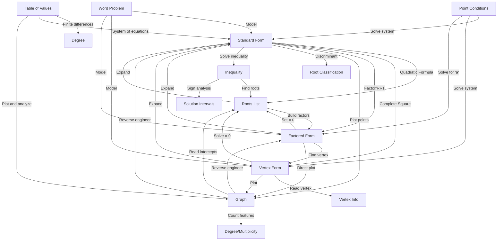

# Master Transformation Map
*Every Possible Route Between Mathematical Representations*

---

## 🎯 PURPOSE

**This is Your Complete Navigation System**

This map shows EVERY possible transformation between different representations of polynomials and functions. Use it to:
- Find the right morphism chain for any problem
- Identify which entry to read
- Plan your solution strategy

**Key Concept:** Mathematics is about transformations. This map shows them all.

---

## 🗺️ THE COMPLETE TRANSFORMATION NETWORK

### Primary Representations (Nodes)

1. **Standard Form**: ax² + bx + c (or higher degree)
2. **Factored Form**: a(x - r₁)(x - r₂)...
3. **Vertex Form**: a(x - h)² + k (quadratics)
4. **Graph**: Visual representation
5. **Roots List**: {r₁, r₂, r₃, ...}
6. **Point Conditions**: Vertex, intercepts, passes through...
7. **Table of Values**: (x, y) pairs
8. **Word Problem**: Real-world scenario
9. **Inequality**: f(x) > 0, etc.

### All Possible Transformations



---

## 📊 TRANSFORMATION MATRIX

**Legend:**  
✅ Direct transformation (one entry)  
🔗 Multi-step (chain entries)  
⚠️ Context-dependent  
❌ Not applicable

### FROM Standard Form TO...

| Destination | Method | Entry to Read | Difficulty |
|------------|--------|---------------|------------|
| Roots | Quadratic Formula / Synthetic Division / RRT | [[Quadratic_Formula]], [[Synthetic_Division]], [[Rational_Root_Theorem]] | ⭐⭐ |
| Factored Form | Factor / Use roots | [[Finding_Polynomial_Roots]] | ⭐⭐⭐ |
| Vertex Form | Complete Square | [[Completing_the_Square]] | ⭐⭐ |
| Graph | Plot features | [[Graphing_Quadratic_Functions]], [[Graphing_Polynomials]] | ⭐⭐ |
| Discriminant Info | Calculate Δ | [[The_Discriminant]] | ⭐ |
| End Behavior | Check degree & LC | [[End_Behavior]] | ⭐ |
| Inequality Solution | Solve & test | [[Polynomial_and_Rational_Inequalities]] | ⭐⭐⭐ |

### FROM Factored Form TO...

| Destination | Method | Entry to Read | Difficulty |
|------------|--------|---------------|------------|
| Roots | Set factors = 0 | [[Working_From_Factored_Form]] | ⭐ |
| Standard Form | Expand | [[Working_From_Factored_Form]] | ⭐⭐ |
| Vertex Form | Find midpoint, evaluate | [[Working_From_Factored_Form]] | ⭐⭐ |
| Graph | Plot roots, use multiplicity | [[Working_From_Factored_Form]] | ⭐⭐ |
| All Features | Direct reading | [[Working_From_Factored_Form]] | ⭐ |

### FROM Vertex Form TO...

| Destination | Method | Entry to Read | Difficulty |
|------------|--------|---------------|------------|
| Vertex | Read (h, k) | [[Completing_the_Square]] | ⭐ |
| Standard Form | Expand | [[Completing_the_Square]] | ⭐ |
| Roots | Solve a(x-h)² + k = 0 | [[Quadratic_Formula]] | ⭐⭐ |
| Graph | Plot vertex, find intercepts | [[Graphing_Quadratic_Functions]] | ⭐⭐ |
| Max/Min Value | Read k | [[Quadratic_Optimization]] | ⭐ |

### FROM Graph TO...

| Destination | Method | Entry to Read | Difficulty |
|------------|--------|---------------|------------|
| Roots | Read x-intercepts | [[Graph_to_Equation]] | ⭐ |
| Factored Form | Count zeros + multiplicities | [[Graph_to_Equation]] | ⭐⭐⭐ |
| Standard Form | Reverse engineer → expand | [[Graph_to_Equation]] | ⭐⭐⭐⭐ |
| Degree | Count turns + 1 | [[Polynomial_Degree_and_Shape]] | ⭐⭐ |
| End Behavior | Observe edges | [[End_Behavior]] | ⭐ |
| Multiplicity | Touch vs cross | [[Root_Multiplicity]] | ⭐⭐ |

### FROM Roots TO...

| Destination | Method | Entry to Read | Difficulty |
|------------|--------|---------------|------------|
| Factored Form | Write (x - r) factors | [[Constructing_Polynomials_from_Roots]] | ⭐ |
| Standard Form | Expand factors | [[Constructing_Polynomials_from_Roots]] | ⭐⭐ |
| Graph | Plot roots, determine shape | [[Constructing_Polynomials_from_Roots]] | ⭐⭐⭐ |
| Vertex (if quadratic) | Midpoint of roots | [[Working_From_Factored_Form]] | ⭐⭐ |

### FROM Point Conditions TO...

| Destination | Method | Entry to Read | Difficulty |
|------------|--------|---------------|------------|
| Standard Form | System of equations | [[Point_Conditions_Method]] | ⭐⭐⭐ |
| Vertex Form | Use vertex, solve for 'a' | [[Point_Conditions_Method]] | ⭐⭐ |
| Factored Form | Use roots, solve for 'a' | [[Point_Conditions_Method]] | ⭐⭐ |

### FROM Inequality TO...

| Destination | Method | Entry to Read | Difficulty |
|------------|--------|---------------|------------|
| Solution Intervals | Find roots, test regions | [[Polynomial_and_Rational_Inequalities]] | ⭐⭐⭐ |
| Critical Points | Solve f(x) = 0 | [[Finding_Polynomial_Roots]] | ⭐⭐ |

---

## 🎯 COMMON PROBLEM PATTERNS

### Pattern 1: "Find the equation of the quadratic..."

**Given options determine route:**

| If Given | Start With | Transform To | Entries Needed |
|----------|------------|--------------|----------------|
| Vertex + point | Vertex form | Standard (if asked) | [[Point_Conditions_Method]] → [[Completing_the_Square]] |
| Three points | Standard form system | Any form | [[Point_Conditions_Method]] |
| Roots + point | Factored form | Any form | [[Constructing_Polynomials_from_Roots]] |
| Graph | Visual analysis | Factored → others | [[Graph_to_Equation]] |

### Pattern 2: "Solve the equation..."

| Equation Form | Method | Entry |
|---------------|--------|-------|
| Standard form | Quadratic Formula / Factor | [[Quadratic_Formula]] or [[Finding_Polynomial_Roots]] |
| Can be factored | Factor and solve | [[Finding_Polynomial_Roots]] |
| Higher degree | RRT + Synthetic Division | [[Rational_Root_Theorem]] + [[Synthetic_Division]] |

### Pattern 3: "Graph the function..."

| Starting Form | Route | Entries |
|---------------|-------|---------|
| Standard | → Find vertex & intercepts → Plot | [[Completing_the_Square]] + [[Graphing_Quadratic_Functions]] |
| Factored | → Plot roots, shape | [[Working_From_Factored_Form]] |
| Vertex | → Plot vertex, find intercepts | [[Graphing_Quadratic_Functions]] |

### Pattern 4: "Find max/min value..."

| Given | Route | Entries |
|-------|-------|---------|
| Standard form | → Complete square → Read k | [[Completing_the_Square]] + [[Quadratic_Optimization]] |
| Factored form | → Find vertex → Evaluate | [[Working_From_Factored_Form]] |
| Word problem | → Model → Optimize | [[Real_World_Applications]] + [[Quadratic_Optimization]] |

---

## 🚀 MORPHISM CHAINS (Multi-Step Routes)

### Chain 1: Standard → Roots → Graph
```
Standard Form
    ↓ [Use Quadratic Formula or RRT]
Roots List
    ↓ [Plot on x-axis]
Partial Graph
    ↓ [Add end behavior, turning points]
Complete Graph
```

**Entries:** [[Quadratic_Formula]] → [[Graph_to_Equation]]

### Chain 2: Graph → Factored → Standard
```
Graph
    ↓ [Read zeros, multiplicities]
Factored Form
    ↓ [Expand]
Standard Form
```

**Entries:** [[Graph_to_Equation]] → [[Working_From_Factored_Form]]

### Chain 3: Word Problem → Model → Solve → Interpret
```
Word Problem
    ↓ [Translate to equation]
Standard/Vertex Form
    ↓ [Find max/min]
Critical Value
    ↓ [Answer in context]
Solution
```

**Entries:** [[Real_World_Applications]] → [[Quadratic_Optimization]]

### Chain 4: Points → System → Any Form
```
Point Conditions
    ↓ [Set up equations]
System of Equations
    ↓ [Solve]
Standard Form
    ↓ [Transform as needed]
Any Other Form
```

**Entries:** [[Point_Conditions_Method]] → (appropriate transformation)

---

## 🔍 QUICK REFERENCE: FINDING YOUR ROUTE

### "I have ______, I need ______"

**Use this lookup:**

**I have Standard Form, I need:**
- Roots → [[Quadratic_Formula]] or [[Rational_Root_Theorem]]
- Vertex → [[Completing_the_Square]]
- Graph → [[Graphing_Quadratic_Functions]]

**I have Factored Form, I need:**
- Everything! → [[Working_From_Factored_Form]]

**I have a Graph, I need:**
- Equation → [[Graph_to_Equation]]

**I have Roots, I need:**
- Equation → [[Constructing_Polynomials_from_Roots]]

**I have Points/Conditions, I need:**
- Equation → [[Point_Conditions_Method]]

**I have Vertex Form, I need:**
- Standard Form → [[Completing_the_Square]] (expansion section)
- Roots → [[Quadratic_Formula]]
- Graph → [[Graphing_Quadratic_Functions]]

---

## 💡 STRATEGY TIPS

### Choose the Shortest Path

**Example:** Given roots and need graph
- ❌ Long: Roots → Standard Form → Complete Square → Graph
- ✅ Short: Roots → Factored Form → Direct Graph

### Leverage Information-Rich Forms

**Factored form reveals most:**
- Roots (instantly)
- Degree (count factors)
- Multiplicity (exponents)
- End behavior (degree + LC)

**Vertex form reveals:**
- Vertex (directly)
- Axis of symmetry (h)
- Max/min (k)
- Opening direction (sign of a)

### When Multiple Routes Exist

**Pick based on:**
1. What form is easiest from your starting point?
2. What intermediate information do you need?
3. What form does the problem ask for?

---

## 🎓 EXAM NAVIGATION

### Before Solving Any Problem:

1. **Identify starting point** (what representation?)
2. **Identify destination** (what's being asked?)
3. **Find your route** (check this map!)
4. **Read relevant entries** (follow the morphism chain)
5. **Execute transformation** (apply the methods)
6. **Verify** (check your result)

### Time-Saving Shortcuts

| Shortcut | When to Use |
|----------|-------------|
| Don't expand unnecessarily | If answer can be left in factored/vertex form |
| Use symmetry | Quadratics have axis of symmetry |
| Estimate first | Check if answer makes sense |
| Work backwards | Sometimes easier to verify than solve |

---

*Remember: Every problem is a journey from one representation to another. This map shows every possible route. Choose wisely, travel efficiently!*

---

## 📚 Complete Entry Index

**Core Transformations:**
- [[Completing_the_Square]] - Standard ↔ Vertex
- [[Finding_Polynomial_Roots]] - Standard → Roots
- [[Constructing_Polynomials_from_Roots]] - Roots → Equation
- [[Working_From_Factored_Form]] - Factored → Everything
- [[Graph_to_Equation]] - Graph → Equation
- [[Point_Conditions_Method]] - Conditions → Equation

**Specialized Topics:**
- [[The_Discriminant]] - Root classification
- [[Synthetic_Division]] - Polynomial division
- [[Rational_Root_Theorem]] - Finding rational roots
- [[End_Behavior]] - Graph behavior at infinity
- [[Root_Multiplicity]] - Understanding repeated roots
- [[Quadratic_Optimization]] - Max/min problems
- [[Graphing_Quadratic_Functions]] - Plotting parabolas
- [[Graphing_Polynomials]] - Plotting higher degree
- [[Graphing_Rational_Functions]] - Asymptotes and discontinuities
- [[Polynomial_and_Rational_Inequalities]] - Solving inequalities
- [[Complex_Conjugate_Roots]] - Imaginary roots
- [[Imaginary_Numbers]] - Complex number system
