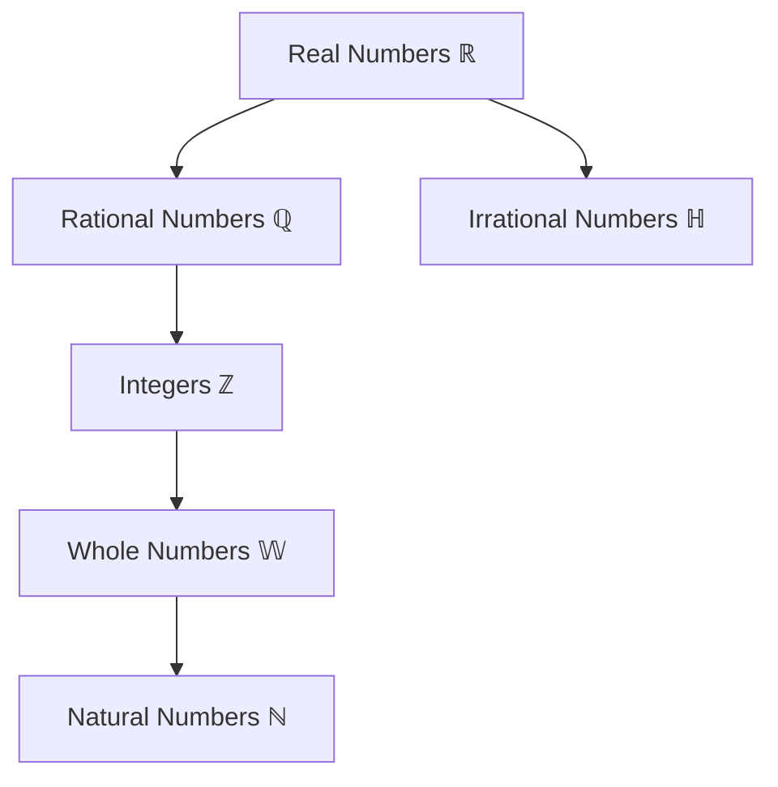

# The Real Number System
*The Foundation of All Algebra*

---

## 🎯 CORE INSIGHT

**The Real Number System is the Organized Hierarchy of All Numbers**

The real number system isn't just a list of numbers—it's a nested structure where each type builds upon and includes the previous types. Understanding this hierarchy is essential because it determines:
- What operations are valid
- What properties apply
- How to classify expressions
- Which domains are appropriate for functions

**The Key Insight:**
```
Each set CONTAINS all previous sets:
ℕ ⊂ 𝕎 ⊂ ℤ ⊂ ℚ ⊂ ℝ
```

**The 5-Year-Old Version:**
Imagine organizing all your toys into nested boxes:
- **Smallest box** (ℕ): Counting blocks: 1, 2, 3, 4...
- **Next box** (𝕎): Add a special "zero" block: 0, 1, 2, 3...
- **Next box** (ℤ): Add opposite blocks: ...-2, -1, 0, 1, 2...
- **Next box** (ℚ): Add fraction pieces: 1/2, 3/4, -2/3...
- **Biggest box** (ℝ): Add weird pieces that can't be fractions: √2, π...

**Why This Matters:**
- **Closure**: Each set is "closed" under certain operations
- **Classification**: Every number has a "home" in the hierarchy
- **Domain restrictions**: Functions need specific number types
- **Problem-solving**: Know which set you're working in

---

## 📖 THE MATHEMATICAL FOUNDATION

### The Complete Hierarchy



**Critical Relationships:**
```
ℕ ⊂ 𝕎 ⊂ ℤ ⊂ ℚ ⊂ ℝ
ℚ ∪ ℍ = ℝ (union of rationals and irrationals gives all reals)
ℚ ∩ ℍ = ∅ (no number is both rational and irrational)
```

### Level 1: Natural Numbers (ℕ)

**Definition:** ℕ = {1, 2, 3, 4, 5, ...}

**Key Properties:**
- The counting numbers
- Starts at 1 (by convention in most modern texts)
- Closed under addition and multiplication
- **NOT** closed under subtraction or division

**Use Cases:**
- Counting discrete objects
- Array indices (in some languages)
- Sequence positions
- Powers and exponents

**Recognition Pattern:**
```
Positive whole numbers without zero
Examples: 5, 42, 1000
Non-examples: 0, -3, 2.5, √2
```

### Level 2: Whole Numbers (𝕎)

**Definition:** 𝕎 = {0, 1, 2, 3, 4, ...}

**Key Properties:**
- Natural numbers PLUS zero
- Zero is the additive identity
- Closed under addition and multiplication
- **NOT** closed under subtraction or division

**Critical Distinction from ℕ:**
```
0 ∈ 𝕎  but  0 ∉ ℕ
```

**Use Cases:**
- Measuring quantities (can have zero of something)
- Array indices (in languages starting at 0)
- Counting with possibility of "none"

**Recognition Pattern:**
```
Non-negative integers
Examples: 0, 7, 150
Non-examples: -1, 3.14, 1/2
```

### Level 3: Integers (ℤ)

**Definition:** ℤ = {..., -3, -2, -1, 0, 1, 2, 3, ...}

**Key Properties:**
- Whole numbers PLUS their opposites
- Closed under addition, subtraction, and multiplication
- **NOT** closed under division
- Contains additive inverses: for every a, there exists -a

**Critical Expansion:**
```
Every whole number w has an opposite -w
𝕎 ∪ {negatives} = ℤ
```

**Use Cases:**
- Temperatures (below zero)
- Elevations (below sea level)
- Financial accounting (debts)
- Coordinate systems

**Recognition Pattern:**
```
Positive and negative whole numbers, including zero
Examples: -5, 0, 42
Non-examples: 1/2, -3.7, √5
```

**Closure Properties:**
```
a, b ∈ ℤ ⟹ a + b ∈ ℤ  ✓
a, b ∈ ℤ ⟹ a - b ∈ ℤ  ✓
a, b ∈ ℤ ⟹ a · b ∈ ℤ  ✓
a, b ∈ ℤ ⟹ a ÷ b ∈ ℤ  ✗ (e.g., 3 ÷ 2 = 1.5 ∉ ℤ)
```

### Level 4: Rational Numbers (ℚ)

**Definition:** ℚ = {p/q | p, q ∈ ℤ and q ≠ 0}

**Key Properties:**
- Can be expressed as ratio of integers
- Closed under addition, subtraction, multiplication, and division (except by zero)
- Includes all terminating decimals
- Includes all repeating decimals
- Contains multiplicative inverses: for every a ≠ 0, there exists 1/a

**Two Decimal Forms:**
```
Terminating: 0.75 = 3/4, 0.125 = 1/8
Repeating: 0.333... = 1/3, 0.142857142857... = 1/7
```

**Recognition Patterns:**
```
CAN be written as p/q:
- All integers: 5 = 5/1 ✓
- All terminating decimals: 0.25 = 1/4 ✓
- All repeating decimals: 0.6̄ = 2/3 ✓

CANNOT be written as p/q:
- √2 = 1.41421356... (never repeats, never ends) ✗
- π = 3.14159265... (never repeats, never ends) ✗
```

**Critical Test:**
```
To verify if decimal is rational:
1. If it terminates → rational ✓
2. If it repeats → rational ✓
3. If neither → irrational ✗
```

**Use Cases:**
- Fractions and proportions
- Probabilities
- Measurements with finite precision
- Most everyday calculations

### Level 5: Irrational Numbers (ℍ)

**Definition:** ℍ = {x ∈ ℝ | x ∉ ℚ}

Numbers that CANNOT be expressed as ratio of integers

**Key Properties:**
- Nonterminating, nonrepeating decimals
- Fill the "gaps" between rational numbers
- Algebraically, often arise from roots and special constants

**Common Examples:**
```
√2 = 1.41421356237... (never repeats)
√3 = 1.73205080757...
π = 3.14159265358...
e = 2.71828182845...
φ (golden ratio) = 1.61803398874...
```

**Recognition Pattern:**
```
Square roots of non-perfect squares: √2, √3, √5, √7...
Cube roots of non-perfect cubes: ∛2, ∛4...
Transcendental constants: π, e
```

**Critical Property:**
```
ℚ ∩ ℍ = ∅  (disjoint sets)
ℚ ∪ ℍ = ℝ  (together form all reals)
```

**Why They Exist (Informal):**
```
Consider a square with side length 1:
Diagonal length = √2 by Pythagorean theorem
But √2 cannot be expressed as p/q!
This number MUST exist geometrically, but isn't rational.
```

### Level 6: Real Numbers (ℝ)

**Definition:** ℝ = ℚ ∪ ℍ

The union of ALL rational and irrational numbers

**Key Properties:**
- Complete: No "gaps" on the number line
- Ordered: Can always compare two reals
- Dense: Between any two reals, there's another real
- Closed under ALL basic operations (except division by zero)
- Corresponds to all points on the number line

**Completeness Property:**
```
Every point on the number line corresponds to exactly one real number
Every real number corresponds to exactly one point on the line
This one-to-one correspondence is fundamental!
```

**Operations:**
```
For a, b ∈ ℝ:
- a + b ∈ ℝ  ✓
- a - b ∈ ℝ  ✓
- a · b ∈ ℝ  ✓
- a ÷ b ∈ ℝ  ✓ (provided b ≠ 0)
- √a ∈ ℝ    ✓ (provided a ≥ 0)
```

**Beyond ℝ:**
```
Complex numbers ℂ extend ℝ to include √(-1) = i
ℝ ⊂ ℂ
But that's another course!
```

---

## 🔧 CLASSIFICATION METHODOLOGY

### Quick Classification Algorithm

**Given a number, classify it:**

```
STEP 1: Can it be written as p/q where p, q are integers?
        YES → Go to STEP 2
        NO → Irrational (ℍ)

STEP 2: Is the denominator q = 1?
        YES → Go to STEP 3
        NO → Rational but not integer (ℚ only)

STEP 3: Is it negative?
        YES → Integer but not whole (ℤ only)
        NO → Go to STEP 4

STEP 4: Is it zero?
        YES → Whole but not natural (𝕎 only)
        NO → Natural number (ℕ)
```

### Complete Classification Examples

**Example 1: Classify 5**
```
Can write as 5/1? YES → rational
Denominator = 1? YES → integer
Negative? NO → not just integer
Zero? NO → not just whole
Result: 5 ∈ ℕ (and therefore also ∈ 𝕎, ℤ, ℚ, ℝ)
```

**Example 2: Classify 0**
```
Can write as 0/1? YES → rational
Denominator = 1? YES → integer
Negative? NO → not just integer
Zero? YES → whole but not natural
Result: 0 ∈ 𝕎 (and therefore also ∈ ℤ, ℚ, ℝ, but 0 ∉ ℕ)
```

**Example 3: Classify -7**
```
Can write as -7/1? YES → rational
Denominator = 1? YES → integer
Negative? YES → integer but not whole
Result: -7 ∈ ℤ (and therefore also ∈ ℚ, ℝ, but -7 ∉ 𝕎, ℕ)
```

**Example 4: Classify 2/3**
```
Can write as p/q? YES (already in that form)
Denominator = 1? NO → rational but not integer
Result: 2/3 ∈ ℚ (and therefore also ∈ ℝ, but 2/3 ∉ ℤ, 𝕎, ℕ)
```

**Example 5: Classify √2**
```
Can write as p/q? NO (proven irrational)
Result: √2 ∈ ℍ (and therefore also ∈ ℝ, but √2 ∉ ℚ, ℤ, 𝕎, ℕ)
```

**Example 6: Classify 0.75**
```
Can write as p/q? YES (0.75 = 3/4)
Denominator = 1? NO → rational but not integer
Result: 0.75 ∈ ℚ (and therefore also ∈ ℝ, but 0.75 ∉ ℤ)
```

---

## 🎓 CRITICAL PROPERTIES AND THEOREMS

### Closure Properties Summary

| Set | + | - | × | ÷ | √ |
|-----|---|---|---|---|---|
| ℕ   | ✓ | ✗ | ✓ | ✗ | ✗ |
| 𝕎   | ✓ | ✗ | ✓ | ✗ | ✗ |
| ℤ   | ✓ | ✓ | ✓ | ✗ | ✗ |
| ℚ   | ✓ | ✓ | ✓ | ✓* | ✗ |
| ℝ   | ✓ | ✓ | ✓ | ✓* | ✓** |

*Except division by zero
**Except square roots of negative numbers

### Density Property

**Between any two distinct real numbers, there exists another real number**

```
For any a, b ∈ ℝ where a < b:
∃ c ∈ ℝ such that a < c < b

In fact, there are INFINITELY many such c!
```

**Practical Implication:**
```
Between 0 and 1, there are infinitely many reals
Between 0.1 and 0.2, there are infinitely many reals
Between 0.11 and 0.12, there are infinitely many reals
...and so on, infinitely nested!
```

### Countability Distinction

**Mind-Blowing Fact:**
```
ℕ, ℤ, and ℚ are COUNTABLE (can list them, even though infinite)
ℍ and ℝ are UNCOUNTABLE (can't list them all, even in principle!)
```

**What This Means:**
- There are "more" irrational numbers than rational numbers!
- Even though rationals are dense, irrationals are "denser"!
- Most numbers are irrational (in a precise mathematical sense)

---

## 🚀 STRATEGIC APPLICATIONS

### Application 1: Domain Determination

**When defining functions, the domain depends on number type:**

**Example: f(x) = √x**
```
Natural domain: x ≥ 0 (non-negative reals)
If x ∈ ℕ: f(4) = 2 ✓, but √2 ∉ ℕ
If x ∈ ℝ⁺ ∪ {0}: Complete domain, all outputs possible
```

**Example: f(n) = 1/n**
```
Natural domain: ℝ \ {0} (all reals except 0)
If n ∈ ℕ: Always defined ✓
If n ∈ ℤ: Must exclude 0
```

### Application 2: Solution Set Classification

**Solving equations produces different solution sets:**

**Example: x² = 4**
```
Solutions: x = ±2
Both solutions ∈ ℤ
Solution set: {-2, 2} ⊂ ℤ
```

**Example: x² = 2**
```
Solutions: x = ±√2
Both solutions ∈ ℍ (irrational!)
Solution set: {-√2, √2} ⊂ ℝ \ ℚ
```

**Example: 2x + 1 = 0**
```
Solution: x = -1/2
Solution ∈ ℚ but ∉ ℤ
Solution set: {-1/2} ⊂ ℚ
```

### Application 3: Approximation and Error

**Understanding number types helps manage approximations:**

```
π ∈ ℍ (exact value)
3.14159 ∈ ℚ (approximation)

For calculations, we use rational approximations of irrationals
But we must remember these are APPROXIMATIONS!
```

**Error Analysis:**
```
True value: π
Approximation: 22/7 ∈ ℚ
Error: |π - 22/7| ≈ 0.00126 (small but nonzero)
```

---

## 💡 COMMON MISCONCEPTIONS

### Misconception 1: Zero is Natural

**Wrong:** 0 ∈ ℕ
**Right:** 0 ∈ 𝕎 but 0 ∉ ℕ

**Why:** Natural numbers are counting numbers, and we count starting at 1

**Note:** Some texts define ℕ to include 0, but this course follows the convention ℕ = {1, 2, 3, ...}

### Misconception 2: All Decimals are Irrational

**Wrong:** 0.333... is irrational
**Right:** 0.333... = 1/3 ∈ ℚ

**Key Test:**
- Terminating decimal? → Rational
- Repeating decimal? → Rational
- Non-terminating AND non-repeating? → Irrational

### Misconception 3: Square Roots are Always Irrational

**Wrong:** √4 is irrational
**Right:** √4 = 2 ∈ ℕ

**Clarification:**
```
√n is irrational ONLY IF n is not a perfect square
√4 = 2 ∈ ℕ ✓
√2 ∈ ℍ ✓
√9 = 3 ∈ ℕ ✓
√5 ∈ ℍ ✓
```

### Misconception 4: Bigger Sets Contain "More" Numbers

**Subtle Point:**
```
ℕ ⊂ ℤ ⊂ ℚ ⊂ ℝ

But both ℕ and ℤ are the "same size" (countably infinite)!
And both ℚ and ℝ are infinite, but ℝ is "larger" (uncountable)!
```

**Moral:** Infinity is weird! Different infinities have different "sizes."

---

## 🔗 RELATIONSHIP MAP

### Direct Dependencies

**Real Number System REQUIRES:**
- Understanding of sets and set notation
- Concept of "closure" under operations
- Basic arithmetic operations

**Real Number System ENABLES:**
- [[Interval_Notation]] - Expressing subsets of ℝ
- [[Absolute_Value]] - Distance from zero in ℝ
- [[Number_Line]] - Geometric representation of ℝ
- [[Domain_Restrictions]] - Determining valid inputs
- All of algebra and calculus!

### Integration Points

**The foundation for:**
```
- Solving equations (solution types depend on number sets)
- Function domains (input restrictions by number type)
- Series and sequences (countability matters)
- Limits and continuity (completeness of ℝ matters)
```

---

## 🏆 MASTERY CHECKLIST

### Level 1: Recognition
- [ ] Can identify ℕ, 𝕎, ℤ, ℚ, ℍ, ℝ by definition
- [ ] Know the nesting structure: ℕ ⊂ 𝕎 ⊂ ℤ ⊂ ℚ ⊂ ℝ
- [ ] Understand ℚ ∪ ℍ = ℝ
- [ ] Can recognize examples of each type

### Level 2: Classification
- [ ] Can classify any given number into its smallest set
- [ ] Know closure properties for each set
- [ ] Can determine if a decimal is rational or irrational
- [ ] Understand why √2 is irrational

### Level 3: Application
- [ ] Can determine appropriate domains for functions
- [ ] Can classify solution sets of equations
- [ ] Understand approximation of irrationals by rationals
- [ ] Can explain why division by zero is undefined

### Level 4: Theoretical Understanding
- [ ] Understand density of ℚ in ℝ
- [ ] Know difference between countable and uncountable
- [ ] Can explain completeness of ℝ
- [ ] Understand bijection with number line

---

**Source References:**
- Miller & Gerken, College Algebra & Trigonometry 2nd Ed., §R.1, pp. 1-8
- Course: MATH 1414 College Algebra

**Tags:** #real-numbers #number-system #hierarchy #foundation #sets #rational #irrational #integers #natural-numbers

**Related Concepts:**
- [[Interval_Notation]]
- [[Absolute_Value]]  
- [[Set_Operations]]
- [[Number_Properties]]
- [[Domain_and_Range]]